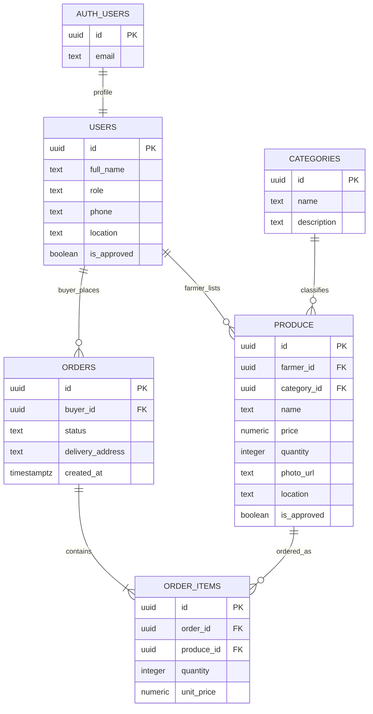

# HarvestLink ER diagram

```mermaid
erDiagram
    AUTH_USERS ||--|| USERS : profile
    USERS ||--o{ PRODUCE : farmer_lists
    CATEGORIES ||--o{ PRODUCE : classifies
    USERS ||--o{ ORDERS : buyer_places
    ORDERS ||--|{ ORDER_ITEMS : contains
    PRODUCE ||--o{ ORDER_ITEMS : ordered_as
    USERS { uuid id PK text full_name text role text phone text location boolean is_approved }
    CATEGORIES { uuid id PK text name text description }
    PRODUCE { uuid id PK uuid farmer_id FK uuid category_id FK text name numeric price integer quantity text photo_url text location boolean is_approved }
    ORDERS { uuid id PK uuid buyer_id FK text status text delivery_address timestamptz created_at }
    ORDER_ITEMS { uuid id PK uuid order_id FK uuid produce_id FK integer quantity numeric unit_price }
    AUTH_USERS { uuid id PK text email }
```
